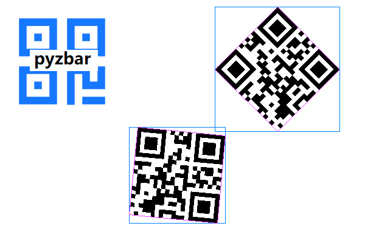
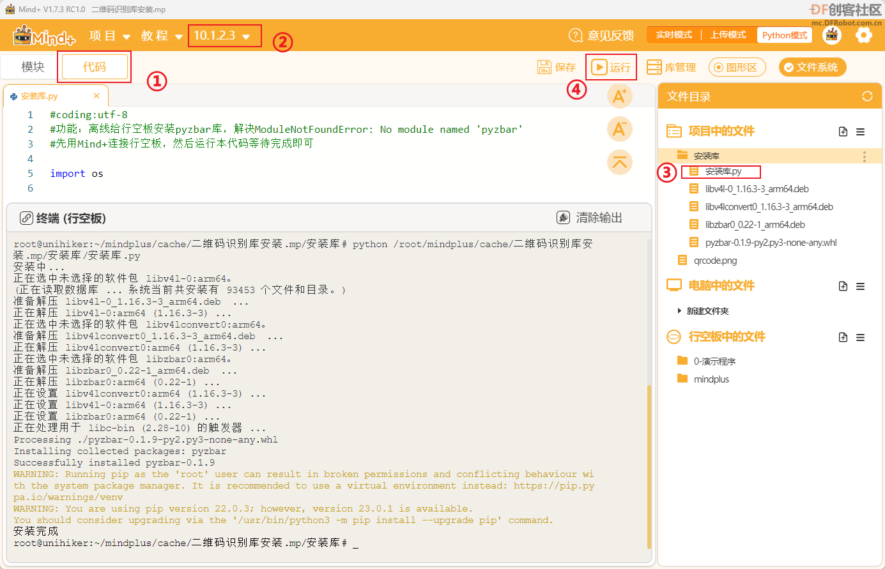
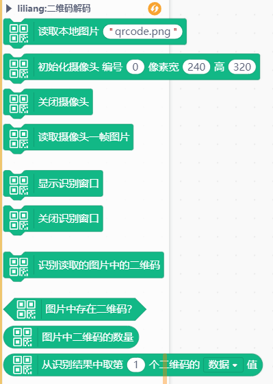

# Pyzbar二维码解码库




---------------------------------------------------------

## Table of Contents

* [URL](#url)
* [Summary](#summary)
* [Blocks](#blocks)
* [License](#license)
* [Supported targets](#Supportedtargets)

## URL
* Project URL : ```https://github.com/liliang9693/ext-qrcode_decode```

* Tutorial URL : ```https://mindplus.dfrobot.com.cn/extensions-user```

    


## Summary
使用Mind+V1.7.2及以上版本包含opencv图形化库的版本，在python模式用户库中加载此扩展，可实现二维码图片或摄像头实时解码。   

如果在行空板中使用，则需要先安装pyzbar库：

**方法1:** 离线安装
- 下载本仓库中的**二维码识别库安装2.mp**，用mind+打开。
- 切换到**代码模式**，打开**安装库**文件夹，双击打开**安装库.py**，然后**连接行空板**，**运行**，等待安装完成即可



**方法2:** 联网安装
- 根据行空板官方文档教程将行空板联网
- 打开Mind+，在Mind+中点击**终端**，连接行空板
- 复制如下命令到终端中回车运行，等待代码执行完毕：   
 ```apt-get install libzbar0 -y```
- 然后复制如下命令到终端中回车运行，等待代码执行完毕：   
 ```pip install pyzbar```


**使用教程**：

【新课标】信息科技跨学科案例-五年级 无人自助收银系统   https://mc.dfrobot.com.cn/thread-314329-1-1.html

## Blocks




## Examples
> 读取本地图片进行解码


> 调用摄像头进行实时解码


## License

MIT

## Supported targets

MCU                | JavaScript    | Arduino   | MicroPython    | Python 
------------------ | :----------: | :----------: | :---------: | -----
arduino        |             |              |             | 
micro:bit        |             |              |             | 
esp32        |             |              |             | 

## Release Logs

* V0.0.1  基础功能完成
* V0.0.2  解决摄像头continu报错

